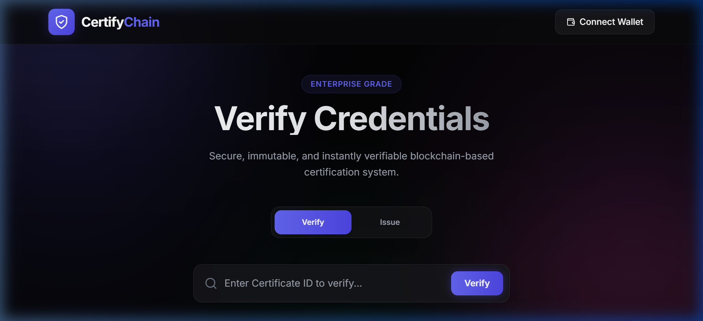
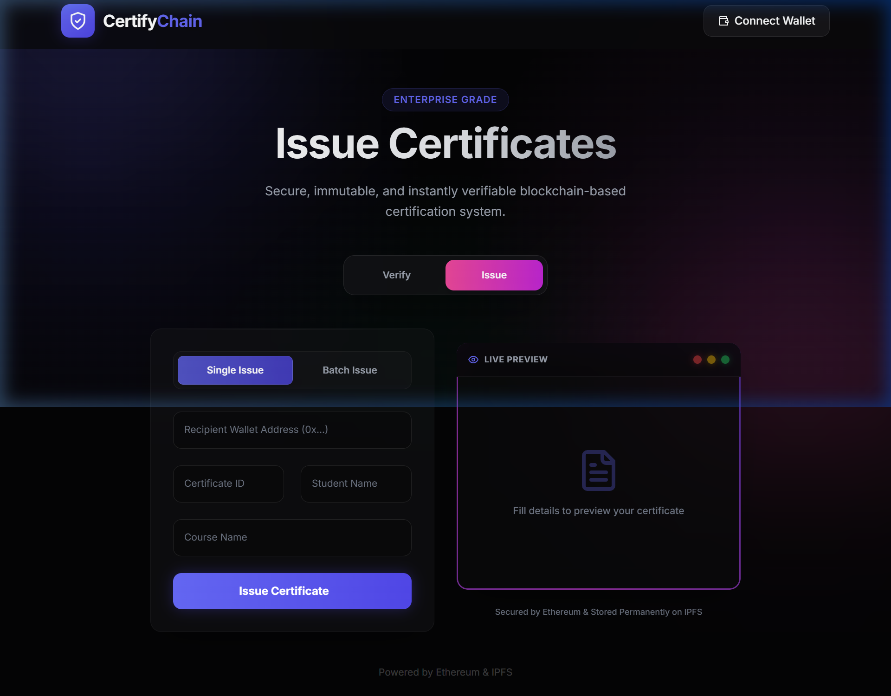

# 🎓 CertifyChain: Blockchain-Based Certification DApp


**CertifyChain** is an enterprise-grade, decentralized application (DApp) that allows educational institutions to issue tamper-proof, immutable, and Soulbound certificates on the Ethereum blockchain. 

Certificates exist as ERC-721 tokens (NFTs) directly on the **Sepolia Testnet** with metadata and verifiable SVGs permanently pinned to **IPFS** via Pinata.

---

## 🚀 Live Demo

*   **🌐 Web Application:** [Deployed on Vercel]((Insert Vercel Link Here After Deployment))
*   **⛓️ Smart Contract (Sepolia):** [`0x7df60C33d87b822DE453548466587613Facf1dE2`](https://sepolia.etherscan.io/address/0x7df60C33d87b822DE453548466587613Facf1dE2)

---

## 📸 Platform Previews

### 1. Verify Credentials (Public Verifier)
Allow anyone to instantly verify a certificate's authenticity on-chain, eliminating credential fraud. Includes QR code sharing and LinkedIn integration.


### 2. Issue Certificates (Admin Dashboard)
Secure administrator dashboard for single or bulk (CSV) issuance. Automatically generates an SVG certificate and pins it to IPFS before minting.


---

## ✨ Key Features

- **🔐 Soulbound Certificates:** Certificates are implemented as non-transferable ERC-721 tokens natively tied to the student's wallet address.
- **📄 Auto SVG Generation:** Dynamically generates stylized, high-quality SVG images representing the certificate.
- **☁️ Decentralized Storage:** Eliminates centralized database dependency by storing all metadata and certificate images securely on **IPFS** via Pinata.
- **⚡ Batch Issuance:** Institutions can bulk-issue hundreds of certificates simultaneously via CSV upload, reducing administrative load.
- **💼 LinkedIn Integration:** One-click functionality for students to seamlessly add their verified credentials directly to their LinkedIn profiles.
- **🎨 Premium UI/UX:** Features a state-of-the-art Glassmorphism interface, skeleton loaders, animated gradient backgrounds, and responsive fluid design.

---

## 🏗️ Technology Stack

**Frontend Framework**
- React.js (Vite)
- TailwindCSS (Custom configuration and animations)
- Framer Motion (Transitions and Micro-animations)
- Lucide React (Icons)
- Ethers.js v6 (Blockchain Interaction)

**Backend / Web3**
- Solidity (Smart Contract logic)
- Hardhat (Development environment and testing)
- OpenZeppelin (Secure standard implementations: ERC721, AccessControl)
- IPFS / Pinata (Decentralized file storage)

---

## ⚙️ Local Development Setup

To run this project locally, you will need `Node.js` and `MetaMask` installed on your browser.

### 1. Clone the Repository
```bash
git clone https://github.com/your-username/certify-chain.git
cd certify-chain
```

### 2. Install Dependencies
```bash
npm install
```

### 3. Setup Environment Variables
Create a `.env` file in the root directory and add your Pinata API keys (and Sepolia RPC/Private Key if you intend to deploy the contract yourself):
```env
VITE_PINATA_API_KEY="your-pinata-api-key"
VITE_PINATA_SECRET_KEY="your-pinata-secret-key"

# Only needed for Smart Contract deployment:
SEPOLIA_RPC_URL="your-alchemy-or-infura-url"
PRIVATE_KEY="your-wallet-private-key"
```

### 4. Run the Development Server
```bash
npm run dev
```

Navigate to `http://localhost:5173` to view the application. Ensure your MetaMask is connected to the **Sepolia** test network.

---

## 📜 Smart Contract Architecture

The core logic lies in `CertificateRegistry.sol`. It utilizes OpenZeppelin's **AccessControl** to assign specific `ISSUER_ROLE` permissions, ensuring only authorized addresses can mint. It overrides the standard `_update` logic to prevent token transfers, solidifying the certificates as "Soulbound".

```solidity
// Example: Preventing token transfers for Soulbound status
function _update(address to, uint256 tokenId, address auth) internal virtual override returns (address) {
    address from = _ownerOf(tokenId);
    require(from == address(0) || to == address(0), "Certificates are Soulbound and non-transferable");
    return super._update(to, tokenId, auth);
}
```

---

## 📄 License
This project is licensed under the MIT License - see the LICENSE file for details.
